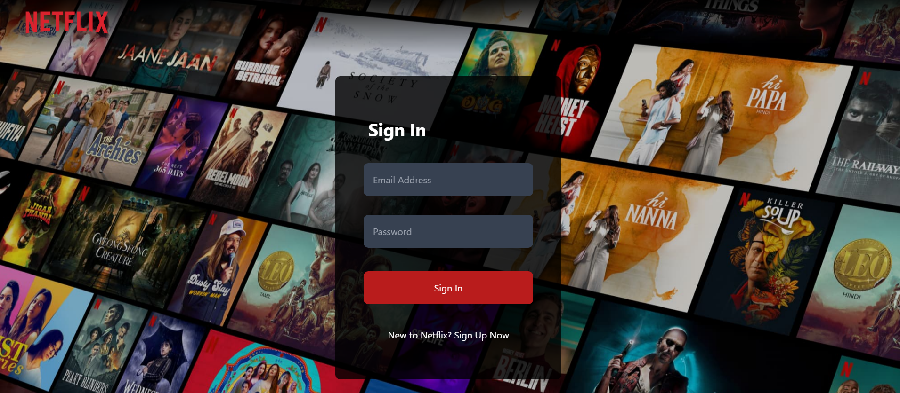
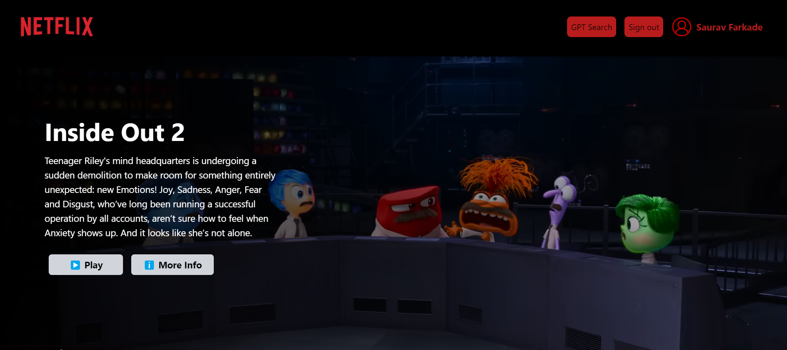
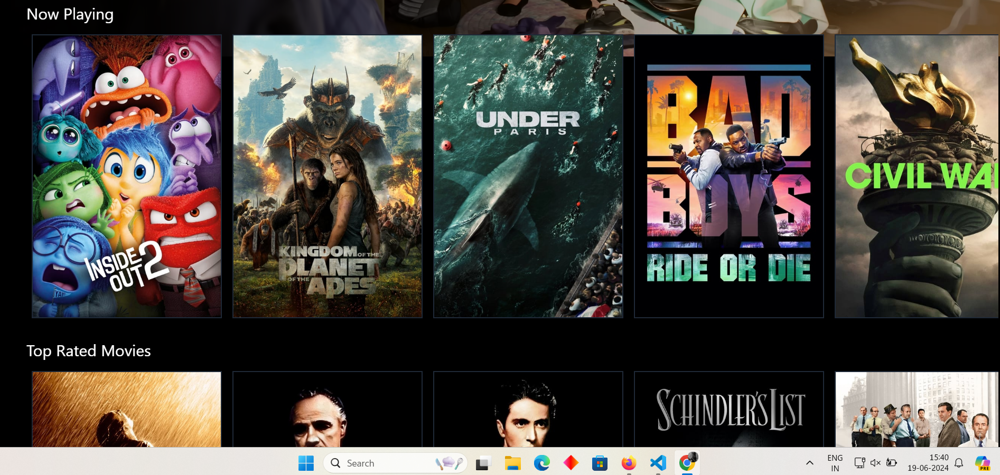
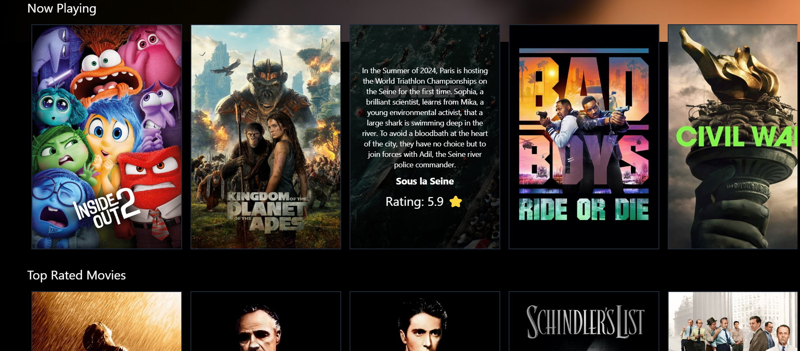
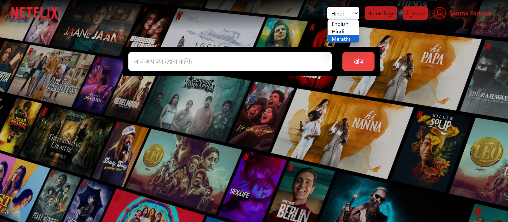

# Visual Overview

### Login Page



### Recent Movie Trailer



### Movie List Page



### Movies Section



### GPT integrated Search Page


=======
# Netflix GPT  


  - link ([https://netflix-gpt-d534b.web.app/](https://main.d33e3ex5y4jr1v.amplifyapp.com/browse))
- Create React App
- Configure TailwindCSS
  - Header
  - Login Form
  - SignUp Form
  - Form Validation
  - Firebase setup
  - Deploying our app to production
  - Create SignUp User Account
  - Implement Sign In user API
  - Created Redux Store with userSlice
  - Implemented Sign out
  - Update Profile
  - BugFix:Sign up user display Name and profile picture Update
  - BugFix:If the user is not logged in Redirect / browse to login Page and Vice versa.
  - Unsubscribed to the onAuthState Change callback
  - Added Hardcoded values inside constants.
  - Registered to TMDB API & create an APP over there
  - Then fetch the API of Now Playing movies.
  - Custom Hook for Now Playing Movies
  - Create A movieSlice
  - Update store with movies Data
  - Planning for MainContainer & secondary container
  - Fetch Data from Trailer Video
  - Update store with Trailer Video Data
  - Embedded the Youtube video and make it auto play and mute
  - Tailwind Classes to make Main Container Look awesome..
  - Build Secondary Component
  - Build Movie List
  - TMDB Image CDN URL
  - Made the broswe Page look awesome
  - Feteched Dynamic API.
  - Did everything using custom hooks hence maintaining maintainer.
  - Building GPT search Feature
  - MultiLanguage Feature Added.
  - GPT AI integrated. (Important Note This Api provides free service only for 3 months from the date of account creation(CHAT GPT account creation.))
  - Get OPEN AI API Key
  - GPT search page
  - Memoization
  - created gptSlice added data..
  - .env file to gitignore...
  - Made it Responsive

# Features

- Login/Sign Up
  - Sign In / Sign Up Form
  - redirect to browse
- Browse(after authentication)
  - Header
  - Main Movie
  - Tailer in background
  - Title & Description
  - Movie Suggestions - MovieLists \* N
- NetFlix GPT - Search Bar - Movie Suggestions

# Installation

1. **Clone the Repo:**
   ```sh
   git clone https://github.com/vedantv3/Netflix_GPT
   ```
2. **Install Required Dependencies**
   npm install
  

3. **Start The Server**
    npm run start

4. **Create Your .env file**

# Usage

- Follow the installation steps to set up the project.
- Navigate to http://localhost:3000 in your browser to view the application.

# Contributing

- If you'd like to contribute, please fork the repository and create a new branch. Pull requests are welcome!
- Regards - Vedant Vedpathak
